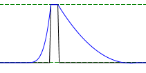
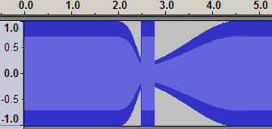
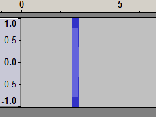
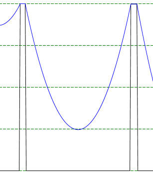
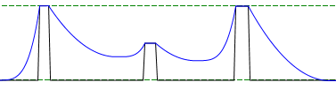

Tutorial
=============

This is a quick overview of what [my compressor](readme.md) actually does. You don't really need to read this unless you're curious about using the advanced options. If you just want to use the plugin quickly, this tutorial won't help much. The only option you should have to change is the first one. For the rest, the defaults should be fine.

I took a bunch of screenshots from a program that I wrote and you can't have. :) (Actually, in the program version of my compressor, you can see that screen by clicking on the Test button. But obviously I can't do that kind of stuff in Audacity without using that monstrosity of a language, C++.)

So, let's practice on some very simple signals.

OK, so this is just a blip. A peak. Your music will have a lot of peaks, but they won't look this clean. But you're learning now, so clean is good. Now, let's introduce a little visual language that I used to develop the plugin. The waveform will be represented in a black line (the same way it's represented by a blue shape in Audacity), and the compression envelope will be represented with a blue line.

"What's a compression envelope?" you say. Well, the easiest thing is to show you.

Imagine that the blue line were attached with invisible strings to the black line, and you pulled the blue line all the way up to the top. That's what just happened.

The main parameter in the compressor is the compress(ion) ratio. Many plugins use a 1:x notation, where x is an integer, but I consider that silly. I use a decimal*, and give you as fine a control as you want. For the image above I used a compress ratio of 1 (and a max amplitude of 1), to keep things simple. With a compress ratio of 1, the invisible strings are completely stiff. With a lower compress ratio, the strings are more elastic, like rubber bands. Lower compress ratios make the rubber bands weaker, and the black line doesn't get pulled up as much, leading to a more subtle effect.

<small>* I'm not entirely sure at the moment what the 1:x notation in other compressors means. In my plugin, with a compress ratio of <i>x</i>, a signal with an amplitude slightly above 0 (e.g. -96 dB) will be raised to amplitude <i>x</i> (which is not in decibels), if you set the floor to 0 (-infinity dB).</small>

The second parameter complements the main parameter. The higher it is, the more the dips in the envelope hang down. At high values, you might hear a little distortion, but if you have a difficult signal you'll be able to hear it better. At low values, you may find that the volume isn't adjusted fast enough.

Now, take a look at this modified signal.

 

Notice that the signal around the blip is completely silent, where in the first one it was at around .25. And yet the diagram is the same. Why doesn't the black line drop way down? Because I have the Floor parameter set to -12 dB, the same level as the sound in the first image. The compressor treats the sound you give it as if everything is at least as loud as the floor.

There are two minor settings I'll mention before the advanced ones:

- The noise gate falloff is related to Floor. By default it's 0, which has no effect. By raising it, you cause sound below the floor to be muted even more. Higher values cause more muting. This is called a ["noise gate"](http://en.wikipedia.org/wiki/Noise_gate) effect, or sometimes simply a "gate". For instance, if you have a track with a guitar riff in it, with portions of silence, the noise gate can mute the noise in the portions where the guitar is silent, to reduce the noise of the overall mix. This also works well for phone call recordings in podcasts. I ought to have another diagram here, but sorry. That link should explain it. (This is not a sophisticated noise gate. It has no attack, hold, or release&#8212;no internal state. It's really just an afterthought.)
- Maximum amplitude is basically the same as the Amplify effect. It's primarily there to prevent minor clipping from rounding errors, but if you want to do negative compression (with a ratio > 1, i.e. making the soft parts louder than the loud parts) then you need to reduce this.

Instead of hardness, you can actually modify four parameters that give you finer control. In the rest of the tutorial I'll explain these. First, download the plugin file with the advanced parameters activated [here](../../../projects/compressor/compress-adv.ny). (You can activate them yourself by editing the file and following the instructions.)

The advanced parameters are the Attack and Release Speed, and the Attack and Release Exponent. The hardness parameter actually just adjusts the speed values (higher hardness means smaller speed). The exponent values can usually just stay where they are. To get a more in depth look, let's look at some more diagrams.

 

See how the envelope rises and falls to meet the peaks. The falling part of the envelope is called the release, and the rising part the attack. The attack and release parameters adjust the shape of those curves. And actually, it's just one curve. It's just that different parts of that curve are used in different places. But for a given set of exponent/speed parameters, it's always exactly the same shape.

You can visualize it like this: A lot of copies are made of the same curve. Each copy is dropped down onto the black line from above and wiggled until it fits tightly into each section. More copies are made as necessary to fit all of the gaps, and all of the excess parts are cut off. It turns out this method produces a single unique curve. If it helps, the curve is determined by the equation f(t) = -((t / release speed) ^ release exponent) when t < 0, ((t / attack speed) ^ attack exponent) when t > 0, where t = 0 is the center of the curve.

There are two ways to modify the shape. One is to change the exponent. You remember the parabola from math class? x2? Here it is:

In this diagram, both the exponent parameters are set to 2. (The floor has also been lowered to -48.) Now, in the compressor, you actually change the left and right half separately, which you don't really do in math class. But it's useful here, because attack and release curves need to be different.  Now let's see what an exponent of 4 looks like:

You can see that the bottom is a lot flatter, and when it starts rising it rises more quickly. The speed options, on the other hand, don't change what kind of curve it is, they only change how wide the curves are. If you want your exponent 2 curve to rise/fall faster, but still keep the same basic shape, you lower the speed. The speed parameters horizontally stretch or compress the curves*. I put the units for speed as milliseconds, which really isn't very accurate. It's an attempt to very roughly equal the usual values for traditional compressors. Here's an exponent 2 curve (release and attack) with a speed of 300 ms (release and attack), next to one with a speed of 600 ms.

<small>* Actually, horizontal and vertical stretching on xn curves have the same effect, but it's easier to visualize it as horizontal.</small>

<table>
<tbody>
<tr>
<td></td>
<td></td>
</tr>
</tbody>
</table>
You can see that the 600 ms one on the right can't get the curve down into the gap as much since the curve is wider.

It's important to note that raising the exponent makes the curve narrower, so if you like the attack speed but want to change the exponent, you need to adjust the attack speed in the same direction as the exponent. For example, here's a curve with a release exponent of 2, an attack exponent of 4, and speeds of 450 ms.

As you can see, the effect is more visible on the far left and right, when the curves have a lot of room around them, but not so much when the peaks are closer together. (That's why I can't adjust for the effect to make the parameters easier to use.) Here's another example, with release exponent 2, speed 600 ms, attack exponent 6, speed 900 ms.

You can see that even with the larger speed, the attack curve is much narrower.

What you've been seeing in the first 5 or so diagrams on this page is a release exponent of 2 and an attack exponent of 4. These are the defaults, since they seem to yield more pleasing results for most music. Music tends to have a lot of reverb, and so if you release too aggressively all you end up hearing after a large peak is the reverb. With a release exponent of 2, the reverb tends to fall off more quickly than the compressor increases the volume. But reverb only goes one way, so we can afford to rise more quickly with the release. And in fact, music tends to have more dramatic increases in volume than it does decreases, partly because of the reverb. So you probably won't need to adjust those too much. You should mainly focus on the speed parameters.

I think that should do it for now.

